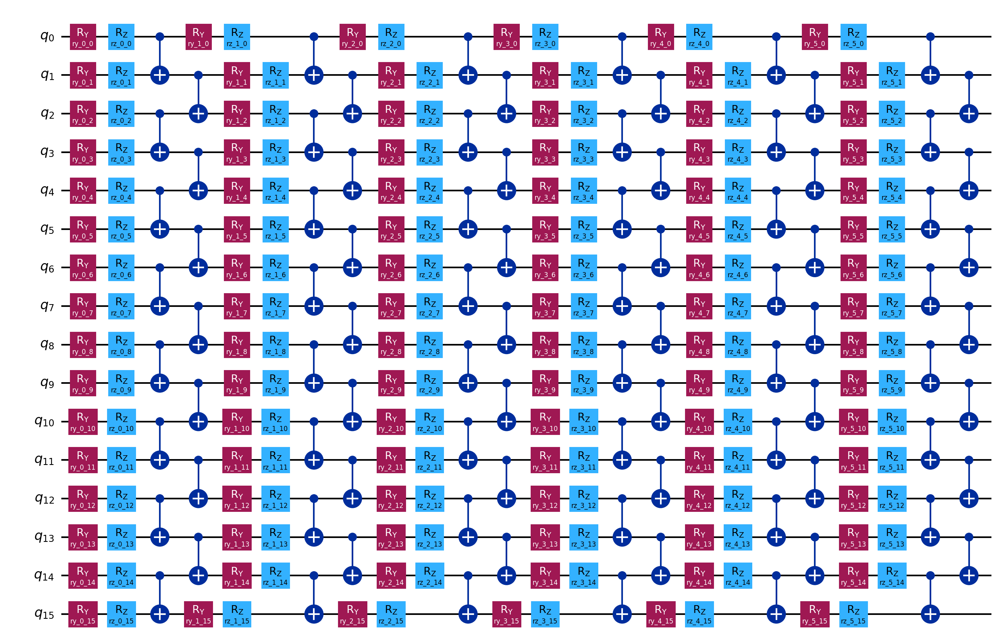

# MARK-B.L.U. 1.0

## A Quantum Hash Function Framework for Security and Verification of Agent Identity and Outputs

MARK-B.L.U. (Base Layer Unification) 1.0 is a quantum-classical hybrid cryptographic architecture for establishing and verifying the identity of autonomous AI agents and their outputs in zero-trust, adversarially uncertain environments. Rather than defending against quantum computation classically, it uses quantum mechanics as the source of security itself; unpredictability here is physical, not algorithmic.

The architecture has two components built in ordered dependency: a quantum hashing core that generates quantum-derived cryptographic identities, and an agent badge rotation system built upon it.

## ARCHITECTURE

### Quantum Hashing Pipeline

The hashing pipeline maps an arbitrary-length classical byte input to a deterministic 256-bit quantum-derived digest through six sequential stages:

| Stage | Module | Description |
| Classical Input | hash_core | Arbitrary-length byte input |
| Parameter Encoder | input_encoder | SHA-512 pre-stretch → 64-byte seed; bytes scaled to θᵢ ∈ [0, 2π]; cyclic HMAC-SHA-512 extension to 192 parameters |
| Quantum Circuit | circuit_builder | 16 qubits, 6 entangling layers; RY+RZ rotations; brick-wall CNOT entanglement |
| Statevector Simulation | hash_core | Exact noiseless simulation; outputs |ψ_out⟩ ∈ ℂ⁶⁵⁵³⁶ |
| Amplitude Extraction | hash_core | Re(αⱼ) and Im(αⱼ) serialized as float64 streams (~1 MB) |
| Final Hash Output | hash_core | H = SHAKE-256("qhash:" ‖ R ‖ I, 32) → 256-bit digest |

The full 16-qubit circuit (282 gates, depth 24, 90 CNOTs, 192 input-dependent parameters):

### Agent Badge & Rotation System

Each agent holds a time-variant 256-bit quantum-derived badge rotating on fixed timeslots (default: 5 min). A persistent serial ID remains constant; the badge shapeshifts, enforcing forward secrecy and preventing entity-trackability.

| Property | Quantum Contribution |
| Temporal Unlinkability | Independent measurements ensure zero statistical linkage across sessions |
| Forward Secrecy | Measurement collapse erases prior quantum state; past badges unrecoverable | 
| Message Authentication | Badges unforgeable due to measurement irreproducibility | 
| Replay Prevention | Non-repeating badge sequences by quantum indeterminacy |
| Quantum Unpredictability | Security grounded in physics, not computational hardness |

## EVALUATION

All experiments run on Qiskit's exact statevector simulator backend.

| Metric | Observed | Ideal |
| Per-sample Shannon entropy (n=500) | 4.884 bits/byte(σ=0.081) | ~5.0 bits/byte |
| Pooled entropy (16,000 bytes) | 7.9886/8.00 bits/byte | 8.0 bits/byte |
| Collisions (1,000 inputs) | 0 | 0 |
| Avalanche flip rate | 49.6%(Δ=0.4pp from ideal) | 50% | 
| BIC avg deviation (1,000 samples) | 1.14pp | ≤1.58pp noise floor | 
| Hamming distance mean (300 pairs) | 128.34/256 bits | 128 bits|
| Byte uniformity χ²(df=255) | 292.58 (threshold: 293.25) | Not rejected at p=0.05 |

## POSITIONING & LIMITATIONS
MARK-B.L.U. 1.0 operates via statevector simulation; a noiseless classical emulation of quantum circuit behavior, rather than physical quantum hardware. This is an intentional staging decision. The 1.0 is designed to:

- establish the mathematical correctness of the architecture,
- empirically validate its cryptographic properties under ideal conditions, and
- provide a reproducible open-source baseline from which hardware-deployed iterations can proceed.

The architecture does not claim post-quantum security in the formal complexity-theoretic sense. It claims information-theoretic unpredictability grounded in quantum mechanical indeterminacy; a property that does not rely on the computational limitations of an adversary, but on the physical impossibility of predicting or replicating quantum measurement outcomes. Operating on 16 qubits, the circuit satisfies NISQ (Noisy Intermediate-Scale Quantum) constraints, an intentional design choice for maximal near-term implementability over raw scale.

## FUTURE DIRECTIONS

- Measurement-based hardware extraction: Transition from statevector simulation to real quantum backends, deriving entropy from physical shot-level randomness rather than structural circuit complexity; upgrading the unpredictability guarantee from computational to information-theoretic.
- Enhanced post-processing: Integration of Toeplitz randomness extractors or multi-round sponge constructions for improved statistical uniformity without compromising the quantum-first entropy source.
- Adversarial robustness: Quantum optimal control, variational parameter tuning, and adversarial noise modelling for circuit design optimization under real-time uncertainty.
Protocol embedding: Integration within verifiable quantum protocols or blockchain-based proof-of-work systems toward a broader quantum-secured agent infrastructure ecosystem.
